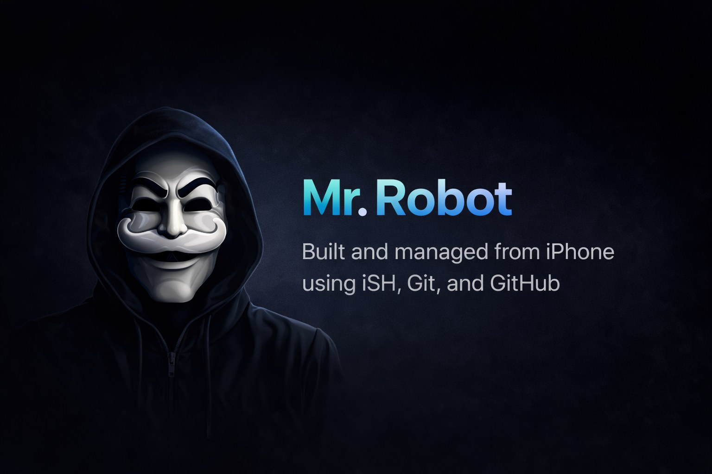

<p align="center">
  
</p>

<h1 align="center">Mr-Robot</h1>

<p align="center">
  <b>A modern, security-focused project built and managed with a mobile-first workflow using iPhone, iSH, Git, and GitHub.</b>
</p>

<p align="center">
  
  
  
  
</p>

---

## Overview

Mr-Robot is a structured repository designed for maintainable development, clear documentation, and long-term project growth.

It provides a solid foundation for organized implementation, future expansion, and consistent repository standards while remaining easy to work with and easy to maintain.

## Key Objectives

- Maintain a clean and scalable codebase
- Keep documentation clear and useful
- Support a consistent Git-based workflow
- Provide a solid foundation for future development
- Keep repository standards production-ready from the beginning

## Features

- Well-structured repository layout
- Professional README and documentation setup
- Contribution, conduct, and security standards included
- GitHub-ready project organization
- Mobile-first development workflow using iPhone and iSH
- Versioned release flow with Git tags
- CLI entrypoint and test coverage included

## Repository Structure

```text
Mr-Robot/
├── .github/
├── assets/
├── docs/
│   ├── architecture.md
│   ├── index.md
│   ├── installation.md
│   ├── roadmap.md
│   └── usage.md
├── examples/
│   └── example_output.txt
├── src/
│   ├── __init__.py
│   ├── cli.py
│   ├── main.py
│   └── version.py
├── tests/
│   ├── __init__.py
│   ├── test_main.py
│   └── test_version.py
├── .editorconfig
├── .env.example
├── .gitignore
├── CHANGELOG.md
├── CODE_OF_CONDUCT.md
├── CONTRIBUTING.md
├── LICENSE
├── Makefile
├── pyproject.toml
├── README.md
├── SECURITY.md
└── requirements.txt
